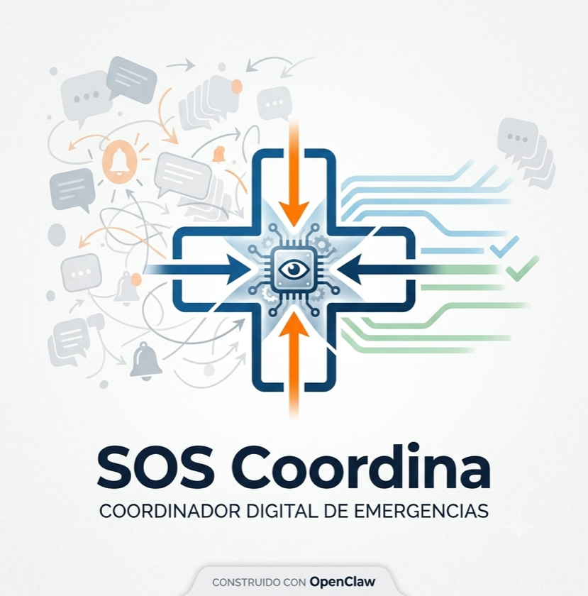
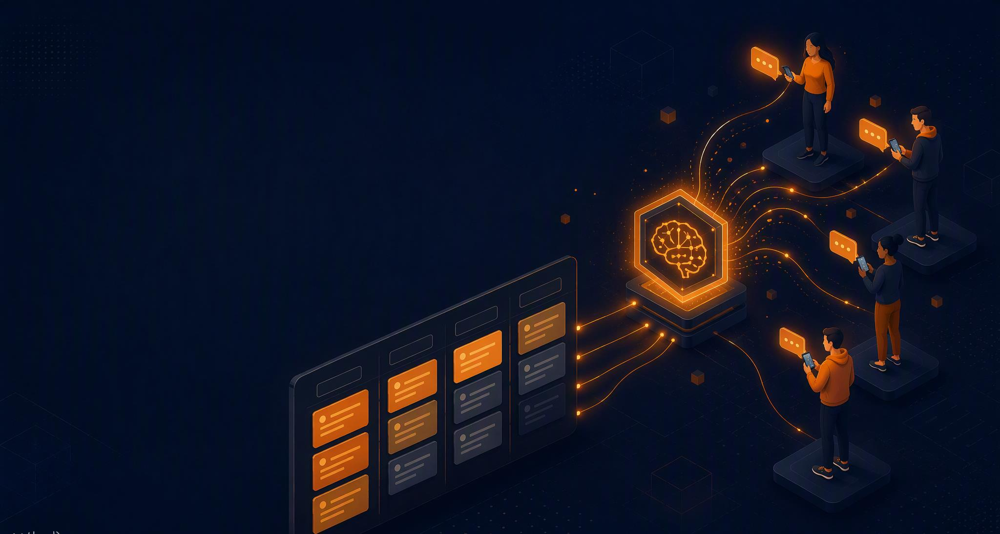
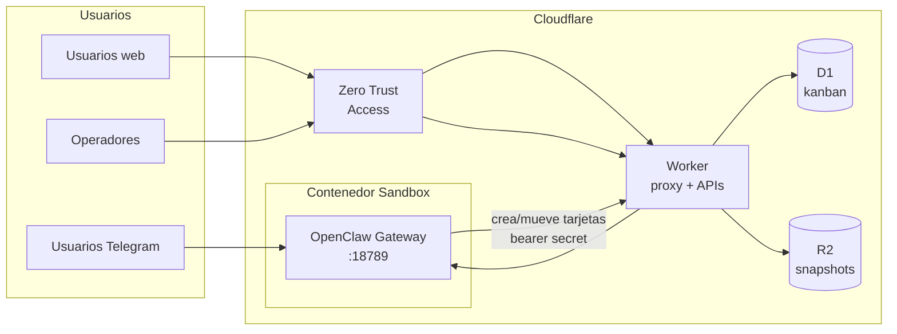
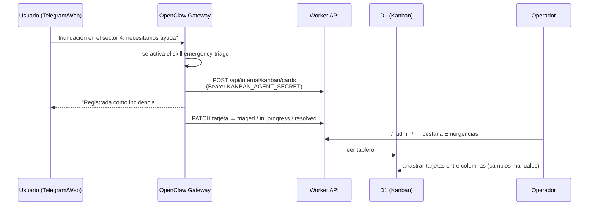

<p align="center">
  
</p>

# SOS Coordina — Coordinación de emergencias con OpenClaw en Cloudflare

[English](./README.md) | **Español**

**Cuando llega la emergencia, que la ayuda se organice sola.**

SOS Coordina es un **coordinador digital de emergencias**: escucha los mensajes de la gente por WhatsApp, Telegram y la web, entiende qué necesita o qué ofrece cada persona, cruza unos con otros y mantiene a todo el mundo informado — construido con [OpenClaw](https://github.com/openclaw/openclaw), tecnología abierta, funcionando íntegramente en la cuenta de Cloudflare de la propia organización.

Para **ayuntamientos**, **ONGs y protección civil** y **redes de voluntarios**.



## El problema: en una emergencia la ayuda sobra — lo que falta es orden

1. **Los mensajes se pierden.** Grupos de WhatsApp improvisados con cientos de mensajes: la información crítica queda enterrada en minutos.
2. **Quien necesita y quien ofrece no se encuentran.** Las webs de difusión acumulan «necesito» y «ofrezco», pero nadie los cruza ni cierra casos.
3. **Todo se repite y caduca.** La misma petición se reenvía decenas de veces y nadie sabe qué sigue vigente ni quién va en camino.
4. **Quien coordina, coordina a ciegas.** Sin una visión de conjunto es imposible responder a la única pregunta que importa: *¿qué falta ahora mismo?*


## La idea

**¿Y si alguien leyera todos los mensajes y los convirtiera en coordinación?**

- **La gente escribe** — «necesito una furgoneta», «ofrezco un almacén» — por WhatsApp, Telegram o la web, sin instalar nada nuevo.
- **OpenClaw ordena** — entiende cada mensaje, une duplicados, valora la urgencia y cruza necesidades con ofertas.
- **Todos ven lo mismo** — un tablero con cada caso y su estado: qué falta, quién lo lleva, qué está resuelto.

Cada caso recibe su número al instante («Caso #7»), cada emparejamiento lo **propone el sistema y lo valida una persona**, y cada caso cerrado queda archivado con sus tiempos — así la siguiente emergencia empieza con un informe de lecciones aprendidas, no desde cero.


## Por qué ahora

- **El coordinador ya existe** — OpenClaw es código abierto maduro (MIT), multicanal, multi-LLM y auditado por la comunidad. No lo inventamos: le enseñamos nuestras reglas de emergencia.
- **El alojamiento está resuelto** — Cloudflare publicó el despliegue de referencia ([Moltworker](https://github.com/cloudflare/moltworker)) que este repo extiende. Escala a cero en reposo y aguanta picos cuando importa.
- **Cuesta calderilla** — ~5 $/mes apagado; unos **50–150 $ por episodio completo de emergencia** (frente a miles de €/año del software comercial de gestión de crisis).
- **Se prueba sin riesgo** — un simulacro con 50 voluntarios y 300 mensajes de prueba, con metas publicadas de antemano (primera respuesta < 1 min, acierto de clasificación ≥ 90 %, matches aceptados por el coordinador ≥ 70 %). Si no se cumplen, no hay piloto — y la decisión la toman personas, con datos.

> **Soberanía de los datos:** todo corre en la cuenta de Cloudflare de la organización. Código abierto y auditable, sin dependencia de proveedor — el sistema completo es portable a un VPS con Docker como plan B.

> **Estado:** MVP funcional construido sobre el PoC Moltworker de Cloudflare (upstream experimental — fijamos versiones y mantenemos un plan B en Docker/VPS). Ver el [Roadmap](#roadmap) para lo siguiente: web pública de estado, alertas de envejecimiento, modo simulacro y WhatsApp vía Meta Cloud API.

[](https://deploy.workers.cloudflare.com/?url=https://github.com/Carluve/moltworker_emergencies)

> **Tras desplegar con el botón:** completa los pasos 2–5 de la [Guía de instalación](#guía-de-instalación) (base de datos D1, secrets, Zero Trust) y vuelve a desplegar.

## Qué obtienes hoy

- **Agente de IA para emergencias** — gateway OpenClaw con webchat (Control UI), accesible desde cualquier navegador
- **Tablero kanban de emergencias** — incidentes en Cloudflare D1 (`Nuevas → Clasificadas → En curso → Resueltas`), editable por humanos **y** por el propio agente
- **Necesidades y ofertas con número de caso** — cada reporte se convierte en una tarjeta de `necesidad` u `oferta` con un número de caso secuencial (`Caso #7`) que el agente devuelve al reportante; el agente propone emparejamientos necesidad↔oferta y los humanos los validan en el tablero
- **Entrada multicanal** — web (integrado), Telegram (token de bot); Discord y Slack soportados; WhatsApp planificado (fase 2)
- **Seguridad Zero Trust** — Cloudflare Access delante del worker, JWT validado dentro del worker, token de gateway y emparejamiento de dispositivos
- **Despliegue automático** — workflow de GitHub Actions que despliega en cada push a `main`
- **Persistencia** — snapshots en R2 que conservan dispositivos emparejados, configuración y conversaciones entre reinicios del contenedor
- **UI de admin bilingüe** — español e inglés, con detección automática

## Roadmap

Alineado con la propuesta de producto (prioridades `MoSCoW`):

| Fase | Funcionalidades | Estado |
|------|-----------------|--------|
| **MVP** | Entrada de mensajes (web + Telegram), clasificación y numeración de casos, tablero kanban, modelo necesidades/ofertas, matches propuestos por el agente con validación humana | ✅ Construido |
| **MVP+** | Web pública de estado (auto-generada: avisos, puntos de recogida, qué se necesita), alertas de urgencias que envejecen (escalado 15/30 min), configuración del territorio (zonas, categorías, plantillas), modo simulacro (generador de mensajes de prueba) | 🔜 Siguiente |
| **Fase 2** | WhatsApp vía **Meta Cloud API** oficial (tramitar el número antes de la crisis), informe post-emergencia con lecciones aprendidas, turnos de guardia y escalado | Planificado |
| **Fase 3** | Dashboard histórico multi-emergencia, atención multilingüe automática, exportación para análisis | Más adelante |

Principio rector en todo el sistema: **el sistema propone, las personas deciden** — todo match, asignación y cierre pasa por una persona.

## Arquitectura



| Componente | Primitiva Cloudflare | Propósito |
|-----------|---------------------|-----------|
| Worker | Workers + Hono | Proxy al gateway, APIs admin/kanban, validación JWT |
| Runtime del agente | Sandbox Containers | Gateway OpenClaw (`openclaw@2026.7.1-2`, Node 22) |
| Almacenamiento kanban | **D1** | Tarjetas del tablero de emergencias |
| Persistencia | **R2** | Snapshots squashfs del home del contenedor |
| Auth en el edge | **Zero Trust Access** | SSO delante del admin UI y la Control UI |
| Automatización de navegador | Browser Rendering | Shim CDP opcional para tareas web |

## Cómo fluyen las emergencias

### Flujo 1 — Reporte por un canal (el agente crea la tarjeta)



### Flujo 2 — Tarjeta manual (la crea el operador)

Los operadores crean tarjetas directamente en el tablero (`/_admin/` → Emergencias → **+ Nueva tarjeta**). El agente puede recogerlas, actualizarlas y resolverlas mientras gestiona incidentes por los canales.

## Requisitos

- [Plan Workers de pago](https://www.cloudflare.com/plans/developer-platform/) (5 $/mes) — necesario para los contenedores Sandbox
- [Clave API de Anthropic](https://console.anthropic.com/) — o Cloudflare AI Gateway con [Unified Billing](https://developers.cloudflare.com/ai-gateway/features/unified-billing/)
- El resto está cubierto por los free tiers: Zero Trust Access, D1, R2, Browser Rendering, AI Gateway

## Opciones de despliegue

| Opción | Cuándo usarla |
|--------|---------------|
| **A. Botón Deploy** | Primer despliegue rápido (botón de arriba), luego termina la Guía de instalación |
| **B. Manual** | Control total desde tu máquina — sigue la Guía de instalación |
| **C. CI (GitHub Actions)** | Despliegues automáticos en cada push a `main` — ver [Despliegues automáticos](#despliegues-automáticos-ci) |

## Guía de instalación

Instalación completa desde cero. Los pasos 1–5 son obligatorios; el resto opcionales.

### 1. Dependencias, proveedor de IA y token del gateway

```bash
npm install

# Proveedor de IA — elige UNO:
npx wrangler secret put ANTHROPIC_API_KEY
# …o Cloudflare AI Gateway (los tres obligatorios):
# npx wrangler secret put CLOUDFLARE_AI_GATEWAY_API_KEY
# npx wrangler secret put CF_AI_GATEWAY_ACCOUNT_ID
# npx wrangler secret put CF_AI_GATEWAY_GATEWAY_ID

# Token del gateway — protege la Control UI. GUARDA este valor.
export MOLTBOT_GATEWAY_TOKEN=$(openssl rand -hex 32)
echo "Tu gateway token: $MOLTBOT_GATEWAY_TOKEN"
echo "$MOLTBOT_GATEWAY_TOKEN" | npx wrangler secret put MOLTBOT_GATEWAY_TOKEN
```

### 2. Base de datos del kanban (D1)

```bash
# Crear la base de datos
npx wrangler d1 create KANBAN_DB
# → copia el database_id de la salida a wrangler.jsonc (sección d1_databases)

# Aplicar el esquema
npx wrangler d1 migrations apply KANBAN_DB --remote

# Secret compartido para que el AGENTE pueda escribir en el tablero
export KANBAN_AGENT_SECRET=$(openssl rand -hex 32)
echo "Tu kanban secret: $KANBAN_AGENT_SECRET"
echo "$KANBAN_AGENT_SECRET" | npx wrangler secret put KANBAN_AGENT_SECRET
```

Sin el binding de D1 el tablero muestra un error de "no configurado" pero todo lo demás funciona. Sin `KANBAN_AGENT_SECRET` el tablero es solo manual.

### 3. Desplegar

```bash
npm run deploy
```

Anota la URL de tu worker (`https://moltbot-sandbox.<subdominio>.workers.dev`). La primera petición tarda 1–2 minutos (arranque en frío del contenedor).

### 4. Zero Trust (Cloudflare Access) — OBLIGATORIO

Este proyecto está diseñado para funcionar detrás de **Cloudflare Zero Trust**. Deben ocurrir dos cosas:

1. **Edge**: Access exige autenticación a los visitantes antes de llegar al worker
2. **Worker**: el worker valida el JWT de Access en las rutas protegidas (`/_admin/*`, `/api/admin/*`, `/debug/*`)

#### 4a. Activar Access en tu worker

1. Ve a [Workers & Pages](https://dash.cloudflare.com/?to=/:account/workers-and-pages) → selecciona `moltbot-sandbox`
2. **Settings → Domains & Routes** → en la fila de `workers.dev`, abre el menú `...` → **Enable Cloudflare Access**
3. Copia el **Team domain** y el **Application Audience (AUD) tag** del diálogo
4. Pulsa **Manage Cloudflare Access** para abrir la política autocreada en el [dashboard de Zero Trust](https://one.dash.cloudflare.com/) y añade los emails de tus operadores (el método de acceso por defecto es PIN de un solo uso; añade proveedores de identidad en **Zero Trust → Settings → Authentication → Login methods**)

#### 4b. Excluir las rutas de máquinas (Bypass)

La aplicación de Access protege **todo el hostname**, pero algunas rutas son para máquinas y el propio worker las protege con secrets compartidos. Añade una política **Bypass** para que Access no las intercepte:

1. En el dashboard de Zero Trust, ve a **Access → Applications** → selecciona la aplicación de tu worker
2. Añade una política nueva: **Action: Bypass**, llámala `machine-routes`
3. En **Additional rules**, añade estas rutas (una regla por ruta, unidas con OR):

   | Ruta | Protegida por |
   |------|---------------|
   | `/api/internal/*` | Worker: bearer `KANBAN_AGENT_SECRET` (agente → API kanban) |
   | `/cdp*` | Worker: query param `?secret=` (automatización de navegador) |
   | `/api/status` | JSON público de estado |
   | `/sandbox-health` | Health check público del contenedor |

> **Importante:** sin este bypass, el agente no puede crear tarjetas kanban y la automatización CDP deja de funcionar. Si lo prefieres, en lugar de Bypass puedes usar una política **Service Auth** con un [service token](https://developers.cloudflare.com/cloudflare-one/access-controls/service-credentials/service-tokens/) enviando las cabeceras `CF-Access-Client-Id` / `CF-Access-Client-Secret` — pero Bypass + secrets a nivel worker es la configuración probada.

#### 4c. Decirle al worker cómo validar JWTs

```bash
# Del diálogo del paso 4a:
npx wrangler secret put CF_ACCESS_TEAM_DOMAIN   # p. ej. myteam.cloudflareaccess.com
npx wrangler secret put CF_ACCESS_AUD           # Application Audience (AUD) tag

npm run deploy
```

Ahora `/_admin/` y la Control UI requieren SSO, y el worker verifica criptográficamente cada JWT de Access (audiencia + emisor + expiración) en las rutas protegidas.

### 5. Abrir la Control UI y emparejar tu dispositivo

1. Visita `https://tu-worker.workers.dev/?token=TU_GATEWAY_TOKEN`
2. Pasarás por Access (SSO/OTP) y luego cargará la Control UI
3. Los dispositivos nuevos empiezan **pendientes** — aprúebalos en `/_admin/` (pestaña Dispositivos → **Aprobar**)

### 6. Persistencia R2 (recomendado)

Sin R2, los dispositivos emparejados y las conversaciones se pierden cuando el contenedor se reinicia.

```bash
# El bucket moltbot-data se crea en el primer despliegue.
# Crea un API token de R2 (R2 → Manage R2 API Tokens → Object Read & Write en moltbot-data),
# y luego:
npx wrangler secret put R2_ACCESS_KEY_ID
npx wrangler secret put R2_SECRET_ACCESS_KEY
npx wrangler secret put CF_ACCOUNT_ID
npm run deploy
```

Los snapshots se hacen automáticamente; lanza uno manual desde `/_admin/` → **Copiar ahora**.

### 7. Canal de Telegram

1. Crea un bot con [@BotFather](https://t.me/BotFather) (`/newbot`) y copia el token
2. Configura y redespliega:

```bash
npx wrangler secret put TELEGRAM_BOT_TOKEN
# Opcional: 'pairing' (por defecto — cada usuario se aprueba en /_admin/) u 'open'
npx wrangler secret put TELEGRAM_DM_POLICY
npm run deploy
```

Los usuarios escriben al bot → los mensajes llegan al agente → las emergencias se convierten en tarjetas kanban automáticamente.

### 8. WORKER_URL (necesario para las llamadas agente → kanban)

```bash
npx wrangler secret put WORKER_URL
# Introduce: https://moltbot-sandbox.<subdominio>.workers.dev
npm run deploy
```

## Uso del sistema

| URL | Qué es |
|-----|--------|
| `/?token=…` | Control UI — webchat con el agente (Access + token + pairing) |
| `/_admin/` → **Emergencias** | Tablero kanban: crear, arrastrar, priorizar, eliminar tarjetas |
| `/_admin/` → **Dispositivos** | Aprobar emparejamientos, reiniciar gateway, copias R2 |
| `/api/status` | JSON público de estado |

El tablero se actualiza solo cada 15 s, así que las tarjetas creadas por el agente aparecen en vivo. Columnas: **Nuevas** (reportes recientes) → **Clasificadas** (evaluadas, prioridad asignada) → **En curso** (gestionándose) → **Resueltas**. La UI de admin está disponible en **español e inglés** (selector ES/EN en la cabecera).

### API del agente

El agente usa `/api/internal/kanban/*` con `Authorization: Bearer <KANBAN_AGENT_SECRET>` (ruta excluida de Access — ver paso 4b):

| Endpoint | Descripción |
|----------|-------------|
| `GET /api/internal/kanban/cards?status=new` | Listar tarjetas (filtro opcional por estado) |
| `POST /api/internal/kanban/cards` | Crear tarjeta (`title` obligatorio; `type` need/offer, `priority`, `source`, `reporter` opcionales) — la respuesta incluye el `case_num` que hay que dar al reportante |
| `PATCH /api/internal/kanban/cards/:id` | Actualizar/mover una tarjeta (`status`, `priority`, `description`, ...) |

Ver `skills/emergency-triage/SKILL.md` para la documentación orientada al agente.

## Despliegues automáticos (CI)

`.github/workflows/deploy.yml` ejecuta tests, compila y despliega en cada push a `main`.

Actívalo en tu fork: **Settings → Secrets and variables → Actions** y añade:

- `CLOUDFLARE_API_TOKEN` — token con permisos de edición de Workers
- `CLOUDFLARE_ACCOUNT_ID` — tu account ID

## Opcional: Cloudflare AI Gateway

Enruta el tráfico del modelo por [AI Gateway](https://developers.cloudflare.com/ai-gateway/) para caché, analítica y rate limiting. Define los tres secrets `CLOUDFLARE_AI_GATEWAY_API_KEY` / `CF_AI_GATEWAY_ACCOUNT_ID` / `CF_AI_GATEWAY_GATEWAY_ID` (paso 1) y, opcionalmente, elige modelo:

```bash
npx wrangler secret put CF_AI_GATEWAY_MODEL
# p. ej. workers-ai/@cf/meta/llama-3.3-70b-instruct-fp8-fast | openai/gpt-4o | anthropic/claude-sonnet-4-5
```

Con [Unified Billing](https://developers.cloudflare.com/ai-gateway/features/unified-billing/), pon en `CLOUDFLARE_AI_GATEWAY_API_KEY` tu token de autenticación de AI Gateway y usa modelos de Workers AI sin clave de proveedor.

## Opcional: otros canales

### Discord

```bash
npx wrangler secret put DISCORD_BOT_TOKEN
npm run deploy
```

### Slack

```bash
npx wrangler secret put SLACK_BOT_TOKEN
npx wrangler secret put SLACK_APP_TOKEN
npm run deploy
```

### WhatsApp (Fase 2 — aún no activado)

El objetivo para la fase 2 es la **Meta Cloud API** oficial — el camino fiable para un despliegue institucional (sin sesión de teléfono vinculado que mantener). Conviene registrar el número y aprobar las plantillas de mensajes **antes** de que llegue la crisis.

Alternativa para pruebas rápidas: el plugin `@openclaw/whatsapp` de OpenClaw (WhatsApp Web / Baileys). **No** está instalado en esta imagen; activarlo requiere:

1. Instalar el plugin en el `Dockerfile` (`openclaw plugins install clawhub:@openclaw/whatsapp`)
2. Añadir la config `channels.whatsapp` (`dmPolicy`, `allowFrom`) al parche de `start-openclaw.sh`
3. Resolver el vinculado por QR en un contenedor headless: ejecutar `openclaw channels login --channel whatsapp` vía `sandbox.exec` y mostrar el QR en el admin UI

## Opcional: automatización de navegador (CDP)

```bash
npx wrangler secret put CDP_SECRET    # cadena aleatoria
npx wrangler secret put WORKER_URL    # https://tu-worker.workers.dev
npm run deploy
```

Endpoints (requieren `?secret=<CDP_SECRET>`): `GET /cdp/json/version`, `GET /cdp/json/list`, `GET /cdp/json/new`, `WS /cdp/devtools/browser/{id}`. El skill `cloudflare-browser` del contenedor los usa. Recuerda que `/cdp*` necesita el bypass de Access del paso 4b.

## Referencia de todos los secrets

| Secret | Obligatorio | Descripción |
|--------|-------------|-------------|
| `ANTHROPIC_API_KEY` | Sí* | Clave Anthropic directa (*o usa AI Gateway) |
| `CLOUDFLARE_AI_GATEWAY_API_KEY` | Sí* | Clave de proveedor enrutada por AI Gateway (+ las dos siguientes) |
| `CF_AI_GATEWAY_ACCOUNT_ID` | Sí* | Account ID de Cloudflare |
| `CF_AI_GATEWAY_GATEWAY_ID` | Sí* | ID del AI Gateway |
| `CF_AI_GATEWAY_MODEL` | No | Modelo alternativo: `proveedor/modelo` |
| `OPENAI_API_KEY` | No | Proveedor alternativo |
| `MOLTBOT_GATEWAY_TOKEN` | **Sí** | Token de la Control UI (`?token=`) |
| `CF_ACCESS_TEAM_DOMAIN` | **Sí** | Team domain de Zero Trust (validación JWT) |
| `CF_ACCESS_AUD` | **Sí** | AUD tag de la aplicación Access (validación JWT) |
| `KANBAN_AGENT_SECRET` | Recomendado | Bearer secret para `/api/internal/kanban` (agente → tablero) |
| `WORKER_URL` | Recomendado | URL pública del worker (llamadas del agente + CDP) |
| `R2_ACCESS_KEY_ID` | Recomendado | Persistencia R2 |
| `R2_SECRET_ACCESS_KEY` | Recomendado | Persistencia R2 |
| `CF_ACCOUNT_ID` | Recomendado | Account ID para URLs prefirmadas de R2 |
| `TELEGRAM_BOT_TOKEN` | No | Canal Telegram |
| `TELEGRAM_DM_POLICY` | No | `pairing` (por defecto) u `open` |
| `DISCORD_BOT_TOKEN` / `DISCORD_DM_POLICY` | No | Canal Discord |
| `SLACK_BOT_TOKEN` / `SLACK_APP_TOKEN` | No | Canal Slack |
| `CDP_SECRET` | No | Secret compartido de automatización de navegador |
| `DEV_MODE` | No | `true` omite Access + pairing (solo desarrollo local) |
| `DEBUG_ROUTES` | No | `true` habilita `/debug/*` |
| `SANDBOX_SLEEP_AFTER` | No | `never` (por defecto) o p. ej. `10m`, `1h` |

## Estimación de costes del contenedor

Instancia `standard-1` (½ vCPU, 4 GiB, 8 GB disco) 24/7: unas **~34,50 $/mes** (memoria ~26 $ + CPU ~2 $ + disco ~1,50 $ + 5 $ del plan). Define `SANDBOX_SLEEP_AFTER=10m` para que duerma en reposo (≈5–6 $/mes de cómputo con ~4 h/día de uso) a costa de arranques en frío de 1–2 min. Ver [precios de Containers](https://developers.cloudflare.com/containers/pricing/).

## Modelo de seguridad (defensa en profundidad)

1. **Zero Trust Access (edge)** — reto SSO/OTP para todo el hostname, menos las rutas de máquinas excluidas
2. **Validación JWT (worker)** — cada ruta protegida verifica criptográficamente el JWT de Access (`CF_ACCESS_TEAM_DOMAIN` + `CF_ACCESS_AUD`)
3. **Token del gateway** — `?token=` obligatorio para la Control UI
4. **Emparejamiento de dispositivos** — cada dispositivo/usuario nuevo se aprueba en `/_admin/`
5. **Secrets compartidos para máquinas** — `KANBAN_AGENT_SECRET` (API kanban), `CDP_SECRET` (navegador); nunca expuestos a navegadores

## Endpoints de depuración

Con `DEBUG_ROUTES=true` (y auth de Access):

- `GET /debug/processes` — procesos del contenedor
- `GET /debug/logs?id=<process_id>` — logs de un proceso
- `GET /debug/version` — versiones

## Resolución de problemas

| Síntoma | Solución |
|---------|----------|
| El agente no crea tarjetas kanban | Comprueba que la política **Bypass** de Access cubre `/api/internal/*` (paso 4b), que `KANBAN_AGENT_SECRET` y `WORKER_URL` están definidos y que D1 está vinculado |
| El tablero muestra "no configurado" | Crea D1, pega el `database_id` en `wrangler.jsonc`, aplica las migraciones y redespliega |
| Bucle 401/redirección en `/_admin/` | Verifica que `CF_ACCESS_TEAM_DOMAIN` + `CF_ACCESS_AUD` coinciden con la app de Access |
| Los cambios de config no se aplican | Sube el comentario `# Build cache bust:` del `Dockerfile` y redespliega |
| Los dispositivos no aparecen | Las llamadas CLI tardan 10–15 s; espera y actualiza |
| Primera petición lenta | Arranque en frío del contenedor (1–2 min) — normal |
| WebSocket falla en local | Limitación conocida de `wrangler dev` — prueba desplegado |
| Windows: exit code 126 | CRLF de Git — configura `core.autocrlf input` (ver [#64](https://github.com/cloudflare/moltworker/issues/64)) |

Logs: `npx wrangler tail`. Secrets: `npx wrangler secret list`.

## Desarrollo local

```bash
cp .dev.vars.example .dev.vars   # añade ANTHROPIC_API_KEY, DEV_MODE=true
npm run start                    # wrangler dev
npm test                         # tests unitarios (vitest)
npm run dev                      # vite dev server (solo admin UI)
```

## Enlaces

- [OpenClaw](https://github.com/openclaw/openclaw) · [Docs de OpenClaw](https://docs.openclaw.ai/)
- [Cloudflare Sandbox](https://developers.cloudflare.com/sandbox/) · [Zero Trust Access](https://developers.cloudflare.com/cloudflare-one/access-controls/policies/) · [D1](https://developers.cloudflare.com/d1/) · [R2](https://developers.cloudflare.com/r2/)
- Proyecto original: [cloudflare/moltworker](https://github.com/cloudflare/moltworker)
