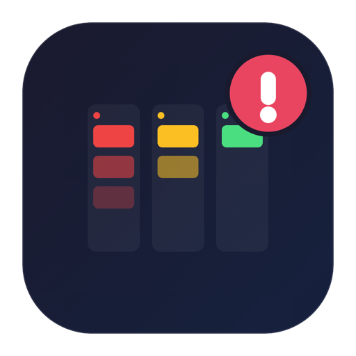
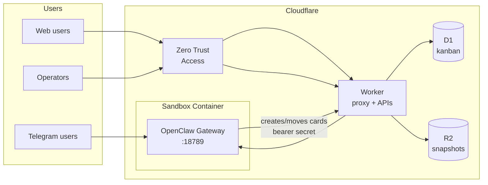
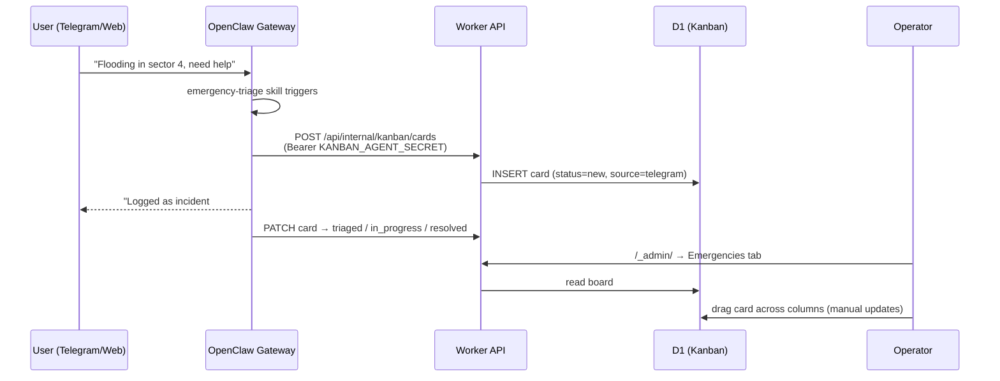

# OpenClaw Emergencies on Cloudflare Workers

**English** | [Español](./README.es.md)

Run [OpenClaw](https://github.com/openclaw/openclaw) (formerly Moltbot/Clawdbot) as an **emergency-response AI assistant** in a [Cloudflare Sandbox](https://developers.cloudflare.com/sandbox/) container — with an incident kanban board, multi-channel intake (web, Telegram), and Zero Trust security.

<p align="center">
  
</p>

## The Mission

When an emergency hits — a flood, a fire, a blackout — people reach out through whatever channel they have at hand, and responders drown in scattered chats. **We want to turn every message into a tracked incident.**

This project is building exactly that:

1. **People report emergencies** through a web chat or Telegram (WhatsApp next) — no app to install, no account to create.
2. **An AI agent listens 24/7**, acknowledges the reporter, asks the right follow-up questions, and files every emergency as a card on a shared kanban board with severity, source and reporter context.
3. **Human operators coordinate** on that board in real time: triage, prioritize, assign states by dragging cards, and watch the agent's work appear live.
4. **Everything runs on Cloudflare's edge** — Workers, Sandbox Containers, D1, R2, Zero Trust — so a small team can deploy a resilient, secure coordination point in minutes, for a few dollars a month.

The goal: **nobody's emergency gets lost in a chat thread again.**

> **Experimental:** This is a proof of concept demonstrating that OpenClaw can run in Cloudflare Sandbox. It is not officially supported and may break without notice. Use at your own risk.

[](https://deploy.workers.cloudflare.com/?url=https://github.com/Carluve/moltworker_emergencies)

> **After a Deploy-button deploy:** complete steps 2–5 of the [Setup Guide](#setup-guide) (D1 database, secrets, Zero Trust) and redeploy.

## What You Get Today

- **AI emergency agent** — OpenClaw gateway with webchat Control UI, reachable from any browser
- **Emergency kanban board** — incidents tracked in Cloudflare D1 (`New → Triaged → In Progress → Resolved`), editable by humans **and** by the agent itself
- **Multi-channel intake** — web (built-in), Telegram (bot token); Discord and Slack supported; WhatsApp planned (phase 2)
- **Zero Trust security** — Cloudflare Access in front of the worker, JWT validated inside the worker, gateway token, and device pairing
- **Auto-deploy** — GitHub Actions workflow deploys on every push to `main`
- **Persistence** — R2 snapshots keep paired devices, config, and conversations across container restarts

## Architecture



| Component | Cloudflare primitive | Purpose |
|-----------|---------------------|---------|
| Worker | Workers + Hono | Proxy to gateway, admin/kanban APIs, JWT validation |
| Agent runtime | Sandbox Containers | OpenClaw gateway (`openclaw@2026.7.1-2`, Node 22) |
| Kanban storage | **D1** | Emergency board cards |
| Persistence | **R2** | Squashfs snapshots of the container home dir |
| Edge auth | **Zero Trust Access** | SSO in front of admin UI and Control UI |
| Browser automation | Browser Rendering | Optional CDP shim for web tasks |

## How Emergencies Flow

### Flow 1 — Report via a channel (agent creates the card)



### Flow 2 — Manual card (operator creates it)

Operators create cards directly on the board (`/_admin/` → Emergencies → **+ New Card**). The agent can then pick them up, update them, and resolve them as it works incidents through the channels.

## Requirements

- [Workers Paid plan](https://www.cloudflare.com/plans/developer-platform/) ($5/month) — required for Sandbox containers
- [Anthropic API key](https://console.anthropic.com/) — or Cloudflare AI Gateway with [Unified Billing](https://developers.cloudflare.com/ai-gateway/features/unified-billing/)
- Free tiers cover the rest: Zero Trust Access, D1, R2, Browser Rendering, AI Gateway

## Deployment Options

| Option | When to use |
|--------|-------------|
| **A. Deploy button** | Fastest first deploy (button above), then finish the Setup Guide |
| **B. Manual** | Full control from your machine — follow the Setup Guide below |
| **C. CI (GitHub Actions)** | Ongoing auto-deploys on every push to `main` — see [Automatic Deployments](#automatic-deployments-ci) |

## Setup Guide

Complete end-to-end setup from a fresh clone. Steps 1–5 are required; the rest are optional.

### 1. Install, AI provider, and gateway token

```bash
npm install

# AI provider — pick ONE:
npx wrangler secret put ANTHROPIC_API_KEY
# …or Cloudflare AI Gateway (all three required):
# npx wrangler secret put CLOUDFLARE_AI_GATEWAY_API_KEY
# npx wrangler secret put CF_AI_GATEWAY_ACCOUNT_ID
# npx wrangler secret put CF_AI_GATEWAY_GATEWAY_ID

# Gateway token — protects the Control UI. SAVE this value.
export MOLTBOT_GATEWAY_TOKEN=$(openssl rand -hex 32)
echo "Your gateway token: $MOLTBOT_GATEWAY_TOKEN"
echo "$MOLTBOT_GATEWAY_TOKEN" | npx wrangler secret put MOLTBOT_GATEWAY_TOKEN
```

### 2. Kanban database (D1)

```bash
# Create the database
npx wrangler d1 create KANBAN_DB
# → copy the database_id from the output into wrangler.jsonc (d1_databases section)

# Apply the schema
npx wrangler d1 migrations apply KANBAN_DB --remote

# Shared secret so the AGENT can write to the board
export KANBAN_AGENT_SECRET=$(openssl rand -hex 32)
echo "Your kanban secret: $KANBAN_AGENT_SECRET"
echo "$KANBAN_AGENT_SECRET" | npx wrangler secret put KANBAN_AGENT_SECRET
```

Without the D1 binding the board shows a "not configured" error but everything else works. Without `KANBAN_AGENT_SECRET` the board is manual-only.

### 3. Deploy

```bash
npm run deploy
```

Note your worker URL (`https://moltbot-sandbox.<subdomain>.workers.dev`). The first request takes 1–2 minutes (container cold start).

### 4. Zero Trust (Cloudflare Access) — REQUIRED

This project is designed to sit behind **Cloudflare Zero Trust**. Two things must happen:

1. **Edge**: Access challenges visitors before they reach the worker
2. **Worker**: the worker validates the Access JWT on protected routes (`/_admin/*`, `/api/admin/*`, `/debug/*`)

#### 4a. Enable Access on your worker

1. Go to [Workers & Pages](https://dash.cloudflare.com/?to=/:account/workers-and-pages) → select `moltbot-sandbox`
2. **Settings → Domains & Routes** → on the `workers.dev` row, open the `...` menu → **Enable Cloudflare Access**
3. Copy the **Team domain** and **Application Audience (AUD) tag** from the dialog
4. Click **Manage Cloudflare Access** to open the auto-created policy in the [Zero Trust dashboard](https://one.dash.cloudflare.com/) and add the emails of your operators (default login method is one-time PIN; add identity providers under **Zero Trust → Settings → Authentication → Login methods**)

#### 4b. Bypass the machine-only routes

The Access application protects the **whole hostname**, but some routes are for machines and are secured by the worker itself with shared secrets. Add a **Bypass** policy so Access doesn't challenge them:

1. In the Zero Trust dashboard, go to **Access → Applications** → select your worker's application
2. Add a new policy: **Action: Bypass**, name it `machine-routes`
3. Under **Additional rules**, add these paths (one rule per path, joined with OR):

   | Path | Secured by |
   |------|-----------|
   | `/api/internal/*` | Worker: bearer `KANBAN_AGENT_SECRET` (agent → kanban API) |
   | `/cdp*` | Worker: `?secret=` query param (browser automation) |
   | `/api/status` | Public health/status JSON |
   | `/sandbox-health` | Public container health check |

> **Important:** without this bypass, the agent cannot create kanban cards and CDP automation breaks. If you prefer, instead of Bypass you can use a **Service Auth** policy with a [service token](https://developers.cloudflare.com/cloudflare-one/access-controls/service-credentials/service-tokens/) and send `CF-Access-Client-Id` / `CF-Access-Client-Secret` headers — but Bypass + worker-level secrets is the tested configuration.

#### 4c. Tell the worker how to validate JWTs

```bash
# From the dialog in step 4a:
npx wrangler secret put CF_ACCESS_TEAM_DOMAIN   # e.g. myteam.cloudflareaccess.com
npx wrangler secret put CF_ACCESS_AUD           # Application Audience (AUD) tag

npm run deploy
```

Now `/_admin/` and the Control UI require SSO, and the worker cryptographically verifies every Access JWT (audience + issuer + expiry) on protected routes.

### 5. Open the Control UI and pair your device

1. Visit `https://your-worker.workers.dev/?token=YOUR_GATEWAY_TOKEN`
2. You'll be prompted through Access (SSO/OTP), then the Control UI loads
3. New devices start **pending** — approve them at `/_admin/` (Devices tab → **Approve**)

### 6. R2 persistence (recommended)

Without R2, paired devices and conversations are lost when the container restarts.

```bash
# The moltbot-data bucket is created on first deploy.
# Create an R2 API token (R2 → Manage R2 API Tokens → Object Read & Write on moltbot-data),
# then:
npx wrangler secret put R2_ACCESS_KEY_ID
npx wrangler secret put R2_SECRET_ACCESS_KEY
npx wrangler secret put CF_ACCOUNT_ID
npm run deploy
```

Snapshots run automatically; trigger one manually from `/_admin/` → **Backup Now**.

### 7. Telegram channel

1. Create a bot with [@BotFather](https://t.me/BotFather) (`/newbot`) and copy the token
2. Configure and redeploy:

```bash
npx wrangler secret put TELEGRAM_BOT_TOKEN
# Optional: 'pairing' (default — each user approved via /_admin/) or 'open'
npx wrangler secret put TELEGRAM_DM_POLICY
npm run deploy
```

Users DM the bot → messages reach the agent → emergencies become kanban cards automatically.

### 8. WORKER_URL (needed for agent → kanban calls)

```bash
npx wrangler secret put WORKER_URL
# Enter: https://moltbot-sandbox.<subdomain>.workers.dev
npm run deploy
```

## Using the System

| URL | What |
|-----|------|
| `/?token=…` | Control UI — webchat with the agent (Access + token + pairing) |
| `/_admin/` → **Emergencies** | Kanban board: create, drag, prioritize, delete cards |
| `/_admin/` → **Devices** | Approve pairing requests, restart gateway, R2 backups |
| `/api/status` | Public status JSON |

The board auto-refreshes every 15s, so cards created by the agent appear live. Columns: **New** (fresh reports) → **Triaged** (assessed, priority set) → **In Progress** (being handled) → **Resolved**. The admin UI is bilingual — switch between **English and Spanish** with the ES/EN toggle in the header (auto-detects browser language, persists your choice).

## Automatic Deployments (CI)

`.github/workflows/deploy.yml` runs tests, builds, and deploys on every push to `main`.

Enable it in your fork: **Settings → Secrets and variables → Actions** and add:

- `CLOUDFLARE_API_TOKEN` — token with Workers edit permissions
- `CLOUDFLARE_ACCOUNT_ID` — your account ID

## Optional: Cloudflare AI Gateway

Route model traffic through [AI Gateway](https://developers.cloudflare.com/ai-gateway/) for caching, analytics, and rate limiting. Set the three `CLOUDFLARE_AI_GATEWAY_API_KEY` / `CF_AI_GATEWAY_ACCOUNT_ID` / `CF_AI_GATEWAY_GATEWAY_ID` secrets (step 1) and optionally pick a model:

```bash
npx wrangler secret put CF_AI_GATEWAY_MODEL
# e.g. workers-ai/@cf/meta/llama-3.3-70b-instruct-fp8-fast | openai/gpt-4o | anthropic/claude-sonnet-4-5
```

With [Unified Billing](https://developers.cloudflare.com/ai-gateway/features/unified-billing/), set `CLOUDFLARE_AI_GATEWAY_API_KEY` to your AI Gateway auth token and use Workers AI models with no provider key.

## Optional: Other Channels

### Discord

```bash
npx wrangler secret put DISCORD_BOT_TOKEN
npm run deploy
```

### Slack

```bash
npx wrangler secret put SLACK_BOT_TOKEN
npx wrangler secret put SLACK_APP_TOKEN
npm run deploy
```

### WhatsApp (Phase 2 — not enabled yet)

OpenClaw supports WhatsApp via the `@openclaw/whatsapp` plugin (WhatsApp Web / Baileys). It is **not** installed in this image. Enabling it requires:

1. Installing the plugin in the `Dockerfile` (`openclaw plugins install clawhub:@openclaw/whatsapp`)
2. Adding `channels.whatsapp` config (`dmPolicy`, `allowFrom`) to the `start-openclaw.sh` patch
3. Solving QR-code linking in a headless container: run `openclaw channels login --channel whatsapp` via `sandbox.exec` and render the QR in the admin UI

## Optional: Browser Automation (CDP)

```bash
npx wrangler secret put CDP_SECRET    # random string
npx wrangler secret put WORKER_URL    # https://your-worker.workers.dev
npm run deploy
```

Endpoints (`?secret=<CDP_SECRET>` required): `GET /cdp/json/version`, `GET /cdp/json/list`, `GET /cdp/json/new`, `WS /cdp/devtools/browser/{id}`. The `cloudflare-browser` skill in the container uses these. Remember `/cdp*` needs the Access bypass from step 4b.

## All Secrets Reference

| Secret | Required | Description |
|--------|----------|-------------|
| `ANTHROPIC_API_KEY` | Yes* | Direct Anthropic key (*or use AI Gateway instead) |
| `CLOUDFLARE_AI_GATEWAY_API_KEY` | Yes* | Provider key routed via AI Gateway (+ the two below) |
| `CF_AI_GATEWAY_ACCOUNT_ID` | Yes* | Cloudflare account ID |
| `CF_AI_GATEWAY_GATEWAY_ID` | Yes* | AI Gateway ID |
| `CF_AI_GATEWAY_MODEL` | No | Model override: `provider/model-id` |
| `OPENAI_API_KEY` | No | Alternative provider |
| `MOLTBOT_GATEWAY_TOKEN` | **Yes** | Control UI token (`?token=`) |
| `CF_ACCESS_TEAM_DOMAIN` | **Yes** | Zero Trust team domain (JWT validation) |
| `CF_ACCESS_AUD` | **Yes** | Access application AUD tag (JWT validation) |
| `KANBAN_AGENT_SECRET` | Recommended | Bearer secret for `/api/internal/kanban` (agent → board) |
| `WORKER_URL` | Recommended | Public worker URL (agent API calls + CDP) |
| `R2_ACCESS_KEY_ID` | Recommended | R2 persistence |
| `R2_SECRET_ACCESS_KEY` | Recommended | R2 persistence |
| `CF_ACCOUNT_ID` | Recommended | Account ID for R2 presigned URLs |
| `TELEGRAM_BOT_TOKEN` | No | Telegram channel |
| `TELEGRAM_DM_POLICY` | No | `pairing` (default) or `open` |
| `DISCORD_BOT_TOKEN` / `DISCORD_DM_POLICY` | No | Discord channel |
| `SLACK_BOT_TOKEN` / `SLACK_APP_TOKEN` | No | Slack channel |
| `CDP_SECRET` | No | Browser automation shared secret |
| `DEV_MODE` | No | `true` skips Access + pairing (local dev only) |
| `DEBUG_ROUTES` | No | `true` enables `/debug/*` |
| `SANDBOX_SLEEP_AFTER` | No | `never` (default) or e.g. `10m`, `1h` |

## Container Cost Estimate

`standard-1` instance (½ vCPU, 4 GiB, 8 GB disk) running 24/7: roughly **~$34.50/mo** (memory ~$26 + CPU ~$2 + disk ~$1.50 + $5 plan). Set `SANDBOX_SLEEP_AFTER=10m` to sleep when idle (≈$5–6/mo compute for ~4h/day usage) at the cost of 1–2 min cold starts. See [Containers pricing](https://developers.cloudflare.com/containers/pricing/).

## Security Model (Defense in Depth)

1. **Zero Trust Access (edge)** — SSO/OTP challenge for the whole hostname, minus the machine routes you bypassed
2. **JWT validation (worker)** — every protected route cryptographically verifies the Access JWT (`CF_ACCESS_TEAM_DOMAIN` + `CF_ACCESS_AUD`)
3. **Gateway token** — `?token=` required for the Control UI
4. **Device pairing** — every new device/DM user approved in `/_admin/`
5. **Shared secrets for machines** — `KANBAN_AGENT_SECRET` (kanban API), `CDP_SECRET` (browser); never exposed to browsers

## Debug Endpoints

With `DEBUG_ROUTES=true` (and Access auth):

- `GET /debug/processes` — container processes
- `GET /debug/logs?id=<process_id>` — process logs
- `GET /debug/version` — versions

## Troubleshooting

| Symptom | Fix |
|---------|-----|
| Agent doesn't create kanban cards | Check the Access **Bypass** policy covers `/api/internal/*` (step 4b), `KANBAN_AGENT_SECRET` and `WORKER_URL` are set, and D1 is bound |
| Board shows "not configured" | Create D1, paste `database_id` in `wrangler.jsonc`, apply migrations, redeploy |
| 401/redirect loop on `/_admin/` | Verify `CF_ACCESS_TEAM_DOMAIN` + `CF_ACCESS_AUD` match the Access app |
| Config changes ignored | Bump `# Build cache bust:` in `Dockerfile` and redeploy |
| Devices not appearing | CLI calls take 10–15s; wait and refresh |
| Slow first request | Container cold start (1–2 min) — normal |
| WebSocket fails locally | `wrangler dev` limitation — test deployed |
| Windows: exit code 126 | Git CRLF — set `core.autocrlf input` (see [#64](https://github.com/cloudflare/moltworker/issues/64)) |

Logs: `npx wrangler tail`. Secrets: `npx wrangler secret list`.

## Local Development

```bash
cp .dev.vars.example .dev.vars   # add ANTHROPIC_API_KEY, DEV_MODE=true
npm run start                    # wrangler dev
npm test                         # unit tests (vitest)
npm run dev                      # vite dev server (admin UI only)
```

## Links

- [OpenClaw](https://github.com/openclaw/openclaw) · [OpenClaw Docs](https://docs.openclaw.ai/)
- [Cloudflare Sandbox](https://developers.cloudflare.com/sandbox/) · [Zero Trust Access](https://developers.cloudflare.com/cloudflare-one/access-controls/policies/) · [D1](https://developers.cloudflare.com/d1/) · [R2](https://developers.cloudflare.com/r2/)
- Upstream project: [cloudflare/moltworker](https://github.com/cloudflare/moltworker)
